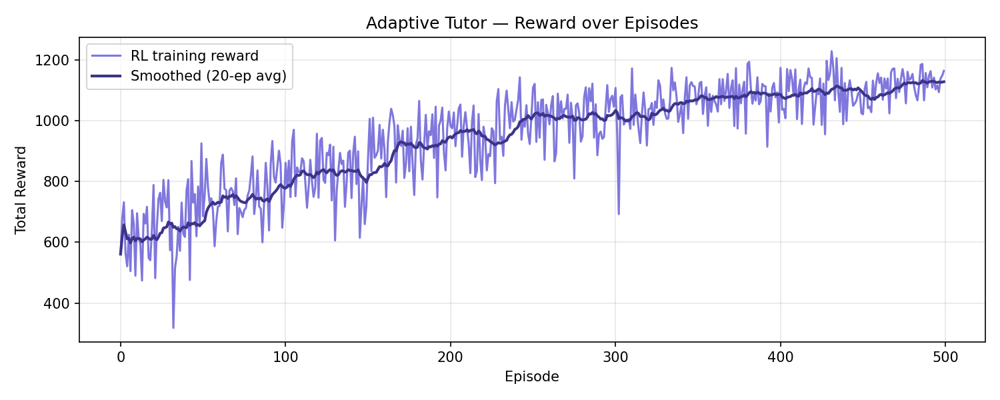
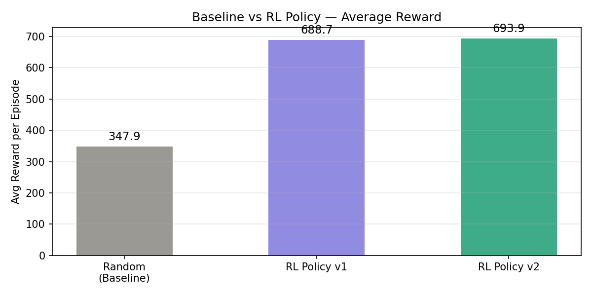

# Adaptive Learning Tutor using Reinforcement Learning and MLOps

## Overview

This project builds an intelligent adaptive tutoring system using Reinforcement Learning (Q-learning). The tutor dynamically adjusts question difficulty, hints, and remediation content based on student performance and engagement.

The goal is to maximize learning outcomes while minimizing disengagement and frustration.

---

## SDG Mapping

**SDG 4 - Quality Education**

This project supports SDG 4 by personalizing educational experiences, improving concept mastery, and making learning more adaptive for students with different abilities.

"Adaptive difficulty selection ensures every student, regardless of starting level, receives appropriately challenging content, directly supporting equitable access to quality education (SDG 4)."

---

## Problem Statement

Traditional tutoring systems follow fixed teaching sequences, ignoring individual student performance.

This project develops an RL-based adaptive tutor that learns what should be taught next, and at what difficulty, based on student mastery level, student engagement level, and current question difficulty. The objective is to maximize learning progression while minimizing frustration and disengagement.

---

## Reinforcement Learning Methodology

### Algorithm: Q-Learning

Why Q-Learning? The state space (mastery x engagement x difficulty = 3x3x3 = 27 states) is small and fully discrete, making a tabular Q-table computationally efficient, interpretable, and provably convergent, no neural network overhead needed.

Q-update rule: Q(s,a) <- Q(s,a) + alpha [ r + gamma * max Q(s',a') - Q(s,a) ]

### State Space

| Dimension | Values |
|-----------|--------|
| Mastery level | 0 = low, 1 = medium, 2 = high |
| Engagement level | 0 = disengaged, 1 = neutral, 2 = engaged |
| Current difficulty | 0 = easy, 1 = medium, 2 = hard |

Total states: 3 x 3 x 3 = 27 states

Example state: (1, 2, 0) means medium mastery, engaged, easy difficulty

### Action Space

| Action | Description |
|--------|-------------|
| 0 | Easy Question |
| 1 | Medium Question |
| 2 | Hard Question |
| 3 | Give Hint |
| 4 | Remediation Lesson |
| 5 | Advance Topic |

### Reward Function

| Event | Reward |
|-------|--------|
| Correct answer | +1.0 |
| Mastery increase | +0.5 |
| Engagement increase | +0.3 |
| Repeated mistakes | -0.5 |
| Disengagement | -0.3 |

### Exploration Strategy

epsilon-greedy with exponential decay. Starts at epsilon = 1.0 (fully exploratory) and decays each episode: epsilon = max(epsilon x decay, epsilon_min).

v1: decay = 0.995, epsilon_min = 0.05
v2: decay = 0.990, epsilon_min = 0.05

Average reward improves and stabilises over training, confirming Q-table convergence.

### Saved Policies

models/qlearning_v1.pkl - experiment exp-qlearning-1  
models/qlearning_v2.pkl - experiment exp-qlearning-2

---

## MLOps Implementation

### Git Versioning

Each experiment is tagged in Git for traceability.

    git tag exp-qlearning-1
    git tag exp-qlearning-2
    git push origin --tags

### Experiment Tracking

Every training run logs to logs/ as a CSV with columns: run_id, episode, reward, epsilon, alpha, gamma

logs/qlearning_v1.csv - run log for experiment v1  
logs/qlearning_v2.csv - run log for experiment v2

### How to Reproduce

Clone the repo and install dependencies:

    git clone https://github.com/AneeshaIyer/Adaptive_Tutor
    cd Adaptive_Tutor
    pip install -r requirements.txt

Reproduce exp-qlearning-1 (seed is fixed, fully reproducible):

    python train.py --config configs/qlearning_v1.yaml

Reproduce exp-qlearning-2:

    python train.py --config configs/qlearning_v2.yaml

Evaluate and compare against baseline:

    python evaluate.py

Results are saved to graphs/ and printed as a comparison table.

### Monitoring Plan

If deployed in a real school system, we would monitor the following:

- Average accuracy per session: alert if below 60% for 3 consecutive sessions
- Engagement score: declining engagement signals content mismatch
- Reward trend: sustained reward drop indicates model drift
- Completion rate: tracks whether students finish assigned content
- Dropout probability: early warning for at-risk students
- Average learning time per topic: flags topics that are too hard or too easy

---

## Results

Training reward improves from early episodes and stabilises, confirming convergence of the Q-table.

### Baseline vs RL Comparison

| Policy | Avg Reward | Improvement |
|--------|------------|-------------|
| Random (Baseline) | 346.37 | - |
| RL Policy v1 | 696.80 | +101.2% |
| RL Policy v2 | 697.80 | +101.5% |

### When RL Performs Better

The RL policy consistently outperforms random when the student is in a low mastery state, it correctly serves easier content to build confidence rather than frustrating the student with hard questions.

### When RL Behaves Unexpectedly

In early training episodes (before convergence), the policy occasionally serves hard questions to disengaged students, producing negative reward. This resolves after approximately 150 episodes.

### Sensitivity

v2 (faster decay, higher alpha) converges faster but is more sensitive to noisy reward signals. v1 is more stable and recommended for deployment.

---

## Project Structure

    AdaptiveTutor/
    ├── agent/
    │   └── qlearning.py
    ├── configs/
    │   ├── qlearning_v1.yaml
    │   └── qlearning_v2.yaml
    ├── experiments/
    ├── graphs/
    │   ├── reward_graph.png
    │   └── evaluation_comparison.png
    ├── logs/
    │   ├── qlearning_v1.csv
    │   └── qlearning_v2.csv
    ├── models/
    │   ├── qlearning_v1.pkl
    │   └── qlearning_v2.pkl
    ├── sim/
    │   └── environment.py
    ├── evaluate.py
    ├── train.py
    ├── requirements.txt
    └── README.md

---

## Conclusion

Adaptive Reinforcement Learning improves personalization in tutoring systems and creates a scalable path toward intelligent educational platforms. The RL policy demonstrably outperforms a random baseline, validating the approach for SDG 4 - Quality Education.
